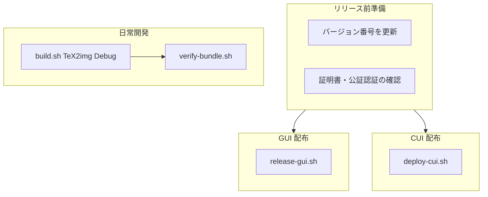

# TeX2img ビルド・配布手順

macOS 版 TeX2img の **ビルドから配布まで** を、最初から順にまとめた手順書です。

---

## 全体像

TeX2img には **2 種類の成果物** があります。

| 成果物 | Xcode スキーム | 配布形式 | 更新通知 |
|--------|----------------|----------|----------|
| **GUI** `TeX2img.app` | `TeX2img GUI` | DMG | Sparkle Appcast |
| **CUI** `tex2img` | `tex2img CUI` | zip | なし（手動配布） |

GUI 版には **CUI が同梱** されます（`Contents/SharedSupport/bin/tex2img`）。配布用 GUI を作るときは、常にこの同梱を確認してください。

### どのコマンドを使うか（早見表）

| 目的 | コマンド |
|------|----------|
| 日常開発（Debug ビルド） | `scripts/build.sh TeX2img Debug` |
| リリースビルドのみ（配布しない） | `scripts/build.sh TeX2img Release` |
| **GUI を配布する** | `scripts/release-gui.sh` |
| CUI を配布する | `scripts/deploy-cui.sh` |

### フロー概要



---

## 前提条件

### 開発環境

- macOS + Xcode（プロジェクト `TeX2img.xcodeproj`）
- Keychain に **Developer ID Application** 証明書
  - 既定: `Developer ID Application: Yusuke Terada (86GWZ48925)`

### 公証（GUI 本番配布のみ）

`notarytool` 用の認証を **いずれか一方** 設定します。

**推奨: キーチェーン・プロファイル**（一度だけ登録）:

```bash
xcrun notarytool store-credentials tex2img-notary \
  --apple-id YOUR_APPLE_ID \
  --team-id 86GWZ48925
# パスワードには appleid.apple.com で発行した App 用パスワードを入力
```

リリース時:

```bash
export NOTARY_KEYCHAIN_PROFILE=tex2img-notary
```

**代替: 環境変数**（CI 向け）:

```bash
export NOTARY_APPLE_ID=...
export NOTARY_PASSWORD=...    # App 用パスワード
export NOTARY_TEAM_ID=86GWZ48925
```

### リポジトリ外のファイル（リポジトリの兄弟ディレクトリ）

| パス | 用途 | 必要なフロー |
|------|------|-------------|
| `../TeX2img_Appcast/TeX2img_Appcast.xml` | Sparkle 用 Appcast | GUI 配布 |
| `../設定/証明書/Sparkle/ed_priv.pem` | Sparkle EdDSA 署名鍵 | GUI 配布 |
| `ThirdParty/Sparkle-2.9.3/bin/sign_update` | Appcast 署名ツール | GUI 配布 |

### ビルド成果物の場所

DerivedData の既定: `~/Developer/DerivedData/TeX2img`（`DERIVED_DATA` で変更可）

```
~/Developer/DerivedData/TeX2img/
├── Build/Products/
│   ├── Debug/
│   │   ├── TeX2img.app
│   │   └── tex2img
│   └── Release/
│       ├── TeX2img.app
│       ├── tex2img
│       ├── TeX2img_{version}.dmg      # release-gui.sh が作成
│       └── tex2imgcMac{version}.zip   # deploy-cui.sh が作成
└── Archives/
    └── TeX2img.xcarchive  # release-gui.sh が作成
```

---

## 1. 日常開発（ビルドのみ）

配布はせず、手元で動かすだけのときの手順です。

```bash
# GUI（CUI 同梱つき）
scripts/build.sh TeX2img Debug

# CUI のみ
scripts/build.sh tex2img Debug
```

`build.sh` は内部で `safe-build.sh` を呼び、GUI ビルド後に `verify-bundle.sh` で CUI 同梱を自動検証します。

### Xcode からビルドする場合

1. スキーム **`TeX2img GUI`** を選ぶ（`tex2img CUI` だけでは `.app` は作れない）
2. Product → Build（⌘B）
3. `scripts/verify-bundle.sh Debug` で同梱確認

スキーム `TeX2img GUI` は `parallelizeBuildables = NO` です（共有 Swift ソースの並列ビルド問題を避けるため）。

---

## 2. リリース前準備

### 2.1 バージョン番号の更新

次の **2 箇所** を揃えて更新します。

| ファイル | キー / 変数 |
|----------|-------------|
| `Resources/Info.plist` | `CFBundleVersion`（GUI） |
| `Sources/CLI/mainc.swift` | `let tex2imgVersion`（CUI） |

### 2.2 動作確認

```bash
scripts/build.sh TeX2img Release
scripts/verify-bundle.sh Release
```

```bash
# バンドル内 CUI のバージョン
TeX2img.app/Contents/SharedSupport/bin/tex2img --version
```

網羅的な変換テストは `te st/` ディレクトリ（`te st/verified-tests.md`）を参照。

---

## 3. GUI 配布

**macOS 10.15 以降、Gatekeeper を通してユーザーに届けるには公証が必要**です。GUI の配布はこのフローのみです。

### 3.1 一括実行

```bash
export NOTARY_KEYCHAIN_PROFILE=tex2img-notary
scripts/release-gui.sh
```

### 3.2 内部で行われること（6 ステップ）

`release-gui.sh` 1 本にまとまっています。

| # | 処理 | 出力 |
|---|------|------|
| 1 | Archive（Developer ID 署名済み） | `Archives/TeX2img.xcarchive` |
| 2 | CUI 同梱検証 | — |
| 3 | アプリ公証 + staple | 公証済み `.app` |
| 4 | DMG 作成 + 署名 | `Release/TeX2img_{version}.dmg` |
| 5 | DMG 公証 + staple | 公証済み `.dmg` |
| 6 | Sparkle Appcast 更新 | `../TeX2img_Appcast/TeX2img_Appcast.xml` |

完了後の主な成果物:

```
~/Developer/DerivedData/TeX2img/Archives/TeX2img.xcarchive
~/Developer/DerivedData/TeX2img/Build/Products/Release/TeX2img_{version}.dmg
../TeX2img_Appcast/TeX2img_Appcast.xml   （更新済み）
```

### 3.3 オプション

DMG の公証を省略する場合（非推奨）:

```bash
SKIP_DMG_NOTARIZE=1 scripts/release-gui.sh
```

### 3.4 配布後

- DMG を配布サーバー（Appcast が指す URL）にアップロード
- Appcast XML も公開先に反映（`release-gui.sh` はローカルの `../TeX2img_Appcast/` を更新するだけ）

---

## 4. CUI 配布

```bash
scripts/deploy-cui.sh
```

### 内部で行われること

1. `build.sh tex2img Release`
2. `tex2imgcMac{version}.zip` を作成（中身は `tex2img` 単体）

CUI 版には公証フローは組み込まれていません。

---

## 5. 技術的背景

### GUI バンドルへの CUI 同梱

Xcode のビルドフェーズ **「Copy Command Line Tools」** が、`tex2img` ターゲットの成果物を GUI バンドルへコピーします。

```
TeX2img.app/
└── Contents/
    ├── SharedSupport/
    │   └── bin/
    │       └── tex2img          ← CUI バイナリ（必須）
    └── Resources/
        ├── mupdf/mudraw
        ├── pdftops/...
        └── ...
```

- 配置先は `Contents/Resources/bin` ではなく **`Contents/SharedSupport/bin`**
- GUI の「CUI をインストール」は `/usr/local/bin/tex2img` へシンボリックリンクを張る（`ControllerG.swift`）
- 同梱版は **CodeSignOnCopy** で再署名されるため、standalone の `tex2img` とバイト単位では一致しない。検証はバージョン文字列で行う

### ビルド順序

共有 Swift ソースを両ターゲットがリンクするため、並列ビルドでリンクエラーやオブジェクト混入が起きることがあります。`safe-build.sh` では次の順序を守ります。

| コマンド | 手順 |
|----------|------|
| `TeX2img` | 先に `tex2img CUI` → 次に `TeX2img GUI` |
| `tex2img` | `tex2img CUI` のみ |
| `all` | 先に `TeX2img GUI` → 次に `tex2img CUI` |

日常開発・配布では `all` より `TeX2img` または `tex2img` を個別に使う方が分かりやすいです。

---

## 6. pdftops の Universal 化（Apple Silicon 対応）

`Resources/pdftops/` は Poppler **20.09.0** のバンドルです。Apple Silicon ネイティブ対応には arm64 スライスを追加します。

```bash
scripts/build-pdftops-universal.sh all
scripts/build-pdftops-universal.sh install   # Resources/pdftops を置換（自動バックアップ）
```

arm64 スライスは **`ARM64_MIN_OS=11.0`（macOS 11+）** を既定とします。

```bash
scripts/verify-universal.sh Resources/pdftops
```

---

## 7. スクリプト一覧

### ビルド・配布

| スクリプト | 説明 |
|-----------|------|
| `scripts/build.sh` | ビルド + GUI 時は bundle 検証（入口） |
| `scripts/safe-build.sh` | xcodebuild ラッパー（`build.sh` から呼ばれる） |
| `scripts/verify-bundle.sh` | CUI 同梱の検証 |
| `scripts/release-gui.sh` | GUI 配布（Archive → 公証 → DMG → Appcast） |
| `scripts/deploy-cui.sh` | CUI zip 作成 |
| `scripts/lib/release-env.sh` | 配布用の共通パス・設定（直接実行しない） |

### その他

| スクリプト | 説明 |
|-----------|------|
| `scripts/build-pdftops-universal.sh` | pdftops universal 化 |
| `scripts/verify-universal.sh` | Mach-O の universal / arm64 min OS 検証 |
| `scripts/generate_cid_table.py` 等 | ソース生成用（配布とは無関係） |

---

## 8. トラブルシューティング

| 症状 | 対処 |
|------|------|
| `SharedSupport/bin/tex2img` がない | `TeX2img GUI` スキームでビルド。`tex2img CUI` だけでは不十分 |
| バンドル内と standalone の tex2img が不一致 | `scripts/build.sh TeX2img` で再ビルド |
| リンクエラー・変なシンボル | `safe-build.sh` の順序付きビルドを使う。`xcodebuild -jobs 1` |
| 公証で認証エラー | `NOTARY_KEYCHAIN_PROFILE` または `NOTARY_APPLE_ID` 等を設定 |
| DMG はできたが Gatekeeper で弾かれる | `release-gui.sh` で公証済み DMG を配布しているか確認 |
| Apple Silicon で pdftops が動かない | `build-pdftops-universal.sh` で universal 化 |

---

## 付録: リリースチェックリスト

GUI 本番リリース時に上から順に確認する一覧です。

- [ ] `Resources/Info.plist` の `CFBundleVersion` を更新
- [ ] `Sources/CLI/mainc.swift` の `tex2imgVersion` を更新
- [ ] `scripts/build.sh TeX2img Release` + `verify-bundle.sh` で動作確認
- [ ] `NOTARY_KEYCHAIN_PROFILE`（または環境変数）が設定済み
- [ ] `../TeX2img_Appcast/TeX2img_Appcast.xml` と DSA 鍵が存在
- [ ] `scripts/release-gui.sh` を実行
- [ ] 生成された DMG を配布サーバーにアップロード
- [ ] 更新された Appcast XML を公開